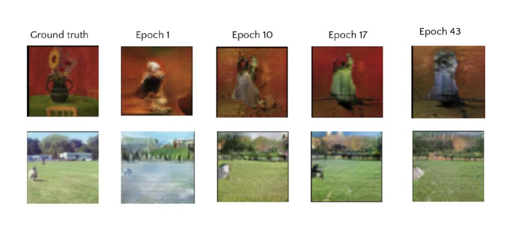

# fmri-reconstruction
## Image reconstruction from human brain activity

This is a part of the project in image reconstruction from human brain activity.

The motivation of the project is to overcome the domain adaptation challenge of visual and fMRI data by analysing and 
combining recent successful approaches in the field of reconstruction based on VAEs and GANs. 


The main focus of this work is Dual-VAE/GAN framework [3] to reconstruct images from presented in BOLD5000 dataset fMRI [1]. 
The network is trained in 3 stages. In this repository you can find the code for the 1st stage. 
On this stage we perform image-to-image mapping for "visual feature guidance" of fMRI encoding used on the 2nd stage. 
I use MS COCO [2] dataset to train the network on this stage.


### Requirements

* Python 3.6
* PyTorch 1.4.0
* Tensorboard 2.3.0


### Project description

#### 1. First steps

* Clone the repository
````
git clone git@github.com:MariaPdg/fmri-reconstruction.git
````

* Set python path
```
export PYTHONPATH=$PYTHONPATH:[absolute path to the folder]/fmri_reconstruction/
```

#### 2. Data

* Download MS COCO dataset.
* Specify data root as well as path to the data and results in *config/data_config.py* 


```
data_root = 'datasets/'

# path to external images used for decoder unsupervised training
test_coco = 'coco_2017/images/test2017/'
train_coco = 'coco_2017/images/train2017/'
valid_coco = 'coco_2017/images/val2017/'

# path for results
save_training_results = 'results/'

```

#### 3. Training and model parameters

These settings can be found in *configs* folder:

* *gan_config* : parameters for training
* *models_config* : parameters used to define model


#### 4. Training

In oder to start training of Dual-VAE/GAN run the script with flags:

```
python3 train/train_vgan_stage1.py -o [root user path] -l [log path]
```

  Flags:
  * -o user path where the results should be saved 
  * -l path to logs

#### Reconstructed examples

Reconstructions are obtained during training on validation dataset.




Paper references: 

   1. Dataset BOLD5000 https://bold5000.github.io/
   2. MS COCO dataset https://cocodataset.org/#download
   3. Ren et al. - Reconstructing seen image from brain activity by visually-guided cognitive representation 
      and adversarial learning, 2021.
      https://www.sciencedirect.com/science/article/pii/S1053811920310879?dgcid=rss_sd_all
   4. Larsen et al. - Autoencoding beyond pixels using a learned similarity metric, 2015
      https://arxiv.org/abs/1512.09300
   5. Beliy et al. - From voxels to pixels and back: Self-supervision in natural-image reconstruction from fMRI, 2019
      https://arxiv.org/abs/1907.02431
   

References to repositories:

1. https://github.com/lucabergamini/VAEGAN-PYTORCH
2. https://github.com/andersbll/autoencoding_beyond_pixels
